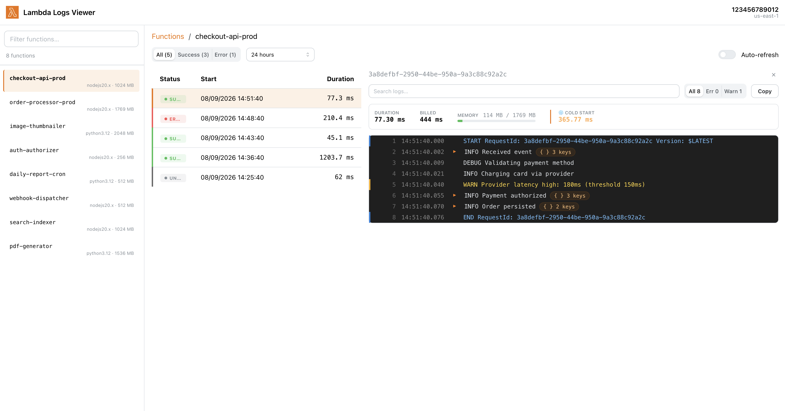

# Lambda Logs Viewer

A fast, local web UI to browse **AWS Lambda invocations and their CloudWatch
logs**. Point it at an AWS account, pick a function, and drill into recent
invocations and logs — with search, level filters, per-invocation metrics
(duration, memory, cold start) and reconstructed success/error status.

It runs entirely on your machine. Route loaders run on a local server and call
AWS directly, so **credentials never reach the browser** and nothing is sent to
any third party.

```
Browser (React UI)  ──►  local server (loaders)  ──►  AWS Lambda + CloudWatch + STS
```



> The screenshot above uses built-in demo data (no AWS account). See
> [Demo mode](#demo-mode) to run it yourself or regenerate the image.

> Status: this tool talks to your real AWS account in read-only fashion. It only
> ever reads (list functions, read logs, get caller identity) — see
> [IAM permissions](#iam-permissions).

## Quick start

You need **Node.js 20+** and AWS credentials available in your shell (see
[AWS credentials](#aws-credentials)).

Run it without installing anything:

```bash
# with an already-logged-in shell (env vars / SSO)
npx lambda-logs-viewer

# or pin a named profile from ~/.aws/config
AWS_PROFILE=my-profile npx lambda-logs-viewer

# or, if you use aws-vault
aws-vault exec my-profile -- npx lambda-logs-viewer
```

Then open the URL it prints (default http://localhost:3000).

Install it globally if you prefer:

```bash
npm install -g lambda-logs-viewer
lambda-logs-viewer
```

## Features

- **Function rail** — searchable, always-visible list of the account's Lambdas;
  resize it and your width preference is remembered.
- **Invocations** — recent invocations reconstructed from CloudWatch
  `START`/`END`/`REPORT` markers, with real status detection
  (success / error / unknown), status filter, time-range selector and opt-in
  auto-refresh.
- **Split view** — select an invocation and its logs open beside the table, no
  page reload.
- **Logs console** — colorized by level, virtualized for large volumes,
  full-text search with match highlighting, level filters (all / errors /
  warnings), and copy-what-you-see.
- **Per-invocation metrics** — the `REPORT` line is rendered as a card: duration,
  billed duration, memory usage bar, and a highlighted **cold start** when an
  init duration is present.
- **Inline JSON** — log lines containing JSON get a collapsible viewer.
- **Read-only account badge** — shows the resolved account and region so you
  always know what you're looking at.

## AWS credentials

The tool is scoped to a **single AWS account/region, resolved once at startup**.
There is no in-app account switching. Resolution order:

1. Static credentials already in the environment
   (`AWS_ACCESS_KEY_ID` / `AWS_SECRET_ACCESS_KEY` / `AWS_SESSION_TOKEN`) — e.g.
   injected by `aws-vault` or CI. These take precedence.
2. Otherwise, `AWS_PROFILE` selects a named profile from `~/.aws/config`.
3. Otherwise, the standard AWS provider chain (shared-config default, SSO, …).

### Configuration

All environment variables are optional:

| Variable      | Role                                                       | Default                             |
| ------------- | ---------------------------------------------------------- | ----------------------------------- |
| `AWS_PROFILE` | Named profile — source of credentials, account and region | ambient shell credentials           |
| `AWS_REGION`  | Region override                                            | profile / env region, else built-in |
| `PORT`        | Local server port                                          | `3000`                              |

A `.env` file in the working directory is loaded automatically (via dotenv), so
you can also set these there.

> **Expired sessions.** With static/temporary credentials (e.g. `aws-vault
> exec`), the session can't be refreshed from inside the app — when it expires,
> restart with a fresh session (`aws-vault exec …`, `aws sso login`, …). SSO /
> assumed-role profiles launched without `aws-vault` refresh automatically.

### IAM permissions

Read-only. The identity you run as needs:

- `lambda:ListFunctions`
- `logs:FilterLogEvents`, `logs:GetLogEvents`, `logs:DescribeLogStreams`
- `sts:GetCallerIdentity`

## How it works

Invocations are **inferred from CloudWatch logs**, not from a metrics API: the
tool reads a function's log group over the selected time range and reconstructs
invocations by grouping the runtime's `START` / `END` / `REPORT` markers by
Request ID. A consequence: a Lambda that was never invoked (or whose logs have
expired) shows no invocations.

## Demo mode

You can run the full UI with built-in, deterministic **dummy data and no AWS
account** — handy for trying it out or for the documentation screenshot. In this
mode the `/api/*` endpoints return fixtures instead of calling AWS.

```bash
npm run demo          # from source: DEMO=1 react-router dev
# or, against an installed/built copy:
DEMO=1 lambda-logs-viewer
```

The demo dataset includes several functions, a mix of success/error/unknown
invocations, and a rich log stream (lifecycle lines, an error, a warning, inline
JSON, and a `REPORT` line with a cold start) so every UI feature is visible.

### Regenerating the screenshot

The image in this README lives at `docs/screenshot.png`. To refresh it:

1. `npm run demo`
2. Open the printed URL, select **checkout-api-prod**, then the top invocation
   so the logs panel and the REPORT metrics card are visible.
3. Capture the browser viewport and save it as `docs/screenshot.png`.

## Contributing

Contributions are welcome. The project is a single **React Router v7** app
(framework mode) with a clean, layered, testable core.

### Run from source

```bash
git clone https://github.com/<owner>/lambda-logs-viewer
cd lambda-logs-viewer
npm install
npm run dev        # dev server with HMR (default http://localhost:3000)
```

Production build:

```bash
npm run build      # react-router build
npm start          # serve the built app
```

### Checks

```bash
npm run typecheck  # react-router typegen + tsc
npm test           # vitest (domain + services)
npm run lint       # Biome (lint + format check)
npm run lint:fix   # Biome (apply fixes)
```

Please keep `typecheck`, `test` and `lint` green in pull requests.

### Project layout

```
app/
  domain/       # pure entities + log parsing (no I/O, no AWS, no React) — unit-tested
  services/     # use cases, depend on provider interfaces (injected, fakeable)
  infra/aws/    # AWS providers (Lambda / CloudWatch / STS), server-only (*.server.ts)
  routes/       # page routes (loaders) + resource routes (/api/*)
  query/        # TanStack Query keys + hooks
  components/   # presentational UI
  config/       # env.server.ts (dotenv)
```

The domain layer depends on nothing technical. Services depend on abstractions
and receive concrete AWS providers from a single container resolved at startup,
so they can be unit-tested with fakes. Credentials and the AWS SDK are confined
to `*.server.ts` and never reach the browser bundle.

## License

MIT — see [LICENSE](./LICENSE).
